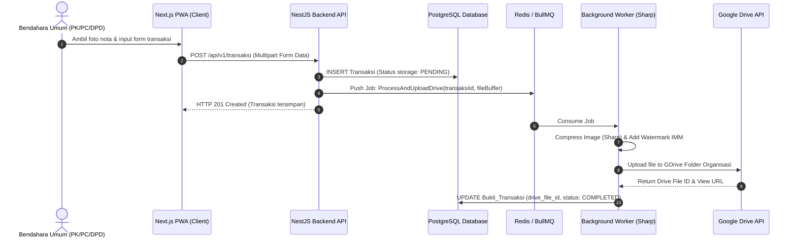

# PANDUAN IMPLEMENTASI PEMBANGUNAN APLIKASI
## Sistem Pencatatan & Pelaporan Keuangan Ikatan Mahasiswa Muhammadiyah (IMM)
**Versi:** 1.0  
**Target Durasi:** 60 Hari Kerja (12 Minggu)  
**Pendekatan:** Development Berbasis MVP (Minimum Viable Product) hingga Full Handover  

---

## 1. RINGKASAN EKSEKUTIF & STRATEGI MVP

Dokumen ini merupakan **Implementation Guide** resmi untuk membangun Sistem Pencatatan dan Pelaporan Keuangan IMM dari nol (*Zero-to-Production*) hingga serah terima (*Handover*). 

Aplikasi ini melayani 4 tingkatan hierarki pimpinan otonom IMM di seluruh Indonesia:
1. **DPP** (Dewan Pimpinan Pusat) - Level Nasional
2. **DPD** (Dewan Pimpinan Daerah) - Level Provinsi
3. **PC** (Pimpinan Cabang) - Level Kota/Kabupaten
4. **PK** (Pimpinan Komisariat) - Level Fakultas/Kampus

### Strategi Akselerasi MVP (Minggu 1 - 5)
Untuk mempercepat validasi nilai bisnis dan memastikan fungsi pencatatan transaksi berbasis bukti nota digital dapat langsung digunakan, pengembangan dibagi menjadi dua tahapan besar:

- **Fase MVP (Minggu 1–5):** Berfokus pada Fondasi Sistem, Autentikasi, Verifikasi Organisasi, Master Data (Seeding 22 Bidang IMM), Pencatatan Transaksi Harian, Kompresi Nota & Watermark dengan Sharp, Integrasi Google Drive Storage (Background Queue), dan Dashboard Ringkasan Organisasi.
- **Fase Pasca-MVP & Handover (Minggu 6–12):** Penguatan Audit Log & Riwayat Perubahan, Dashboard Roll-up Agregat Multi-Level, Ekspor Laporan Excel/PDF, PWA Offline, UAT, Deployment Production, dan Handover.

---

## 2. ARSITEKTUR TEKNIS & TECH STACK

### 2.1 Ringkasan Teknologi
| Komponen | Teknologi Utama | Alasan Pemilihan & Fungsi |
| :--- | :--- | :--- |
| **Frontend** | Next.js (React), PWA | SSR untuk pergerakan awal muat, PWA untuk instalasi mobile & akses kamera native. |
| **Styling & UI** | Tailwind CSS, Lucide Icons | Utility-first CSS mengacu pada [STYLE_GUIDE.md](file:///Users/macbook/Desktop/Software%20IMM/STYLE_GUIDE.md) (3 Warna Flat Pastel: Primer `#2D3748`, Sekunder `#81B29A`, Aksen `#F4A261`). |
| **State & Query** | TanStack Query (React Query) | Caching data server, auto-refetch, dan sinkronisasi state server. |
| **Form & Validasi** | React Hook Form + Zod | Validasi skema kustom, termasuk penguncian eksklusif pemasukan vs pengeluaran. |
| **Visualisasi** | Recharts | Pie chart & tren bulanan transaksi pada dashboard. |
| **Backend Runtime** | Node.js + NestJS | Framework modular (Module per domain) yang sangat scalable untuk multi-tenant. |
| **Database Utama** | PostgreSQL | Relasional solid, mendukung JSONB untuk Audit Log & Closure Table untuk hierarki. |
| **Hierarki Query** | Closure Table (`Organisasi_Ancestry`) | Query *tree structure* multi-level tanpa recursive CTE yang lambat. |
| **Background Queue** | Redis + BullMQ | Antrean asynchronous untuk kompresi foto & upload Google Drive API. |
| **Image Processing** | Sharp | Resizing foto, kompresi kualitas 80%, dan penambahan watermark otomatis. |
| **Storage Bukti** | Google Drive API (Service Account) | Solusi penyimpanan bukti nota murah/gratis dengan folder terstruktur per organisasi. |

### 2.2 Diagram Alir Data Transaksi (MVP Core)


---

## 3. PANDUAN PEMBANGUNAN STEP-BY-STEP (60 HARI KERJA)

---

### MINGGU 1: SETUP FONDASI SYSTEM & DATABASE
**Fokus:** Mempersiapkan repository, infrastruktur dev, basis data PostgreSQL, dan skema dasar.

#### Hari 1 (Senin): Inisialisasi Project & Repository
1. Inisialisasi Monorepo atau Dual-Repo (Frontend `imm-finance-fe`, Backend `imm-finance-be`).
2. Setup Next.js (TypeScript, App Router, Tailwind CSS, TanStack Query).
3. Setup NestJS (TypeScript, Prisma ORM / TypeORM, ConfigModule, ValidationPipe).
4. Buat `.env.example` untuk konfigurasi DB, JWT Secret, Redis, dan Google Drive API credentials.

#### Hari 2 (Selasa): Skema Basis Data PostgreSQL - Part 1 (Multi-Tenant & Auth)
1. Buat migration database untuk tabel `organisasi` dan `user`:
```sql
CREATE TYPE level_organisasi AS ENUM ('DPP', 'DPD', 'PC', 'PK');
CREATE TYPE status_organisasi AS ENUM ('pending', 'verified', 'rejected');
CREATE TYPE role_user AS ENUM ('bendahara_umum', 'tim_verifikasi_internal', 'super_admin');

CREATE TABLE organisasi (
    id UUID PRIMARY KEY DEFAULT gen_random_uuid(),
    nama VARCHAR(255) NOT NULL,
    level level_organisasi NOT NULL,
    status status_organisasi NOT NULL DEFAULT 'pending',
    alasan_penolakan TEXT,
    created_at TIMESTAMP DEFAULT CURRENT_TIMESTAMP,
    updated_at TIMESTAMP DEFAULT CURRENT_TIMESTAMP
);

CREATE TABLE users (
    id UUID PRIMARY KEY DEFAULT gen_random_uuid(),
    organisasi_id UUID NOT NULL REFERENCES organisasi(id) ON DELETE CASCADE,
    nama VARCHAR(255) NOT NULL,
    email VARCHAR(255) UNIQUE NOT NULL,
    password_hash VARCHAR(255) NOT NULL,
    role role_user NOT NULL,
    is_active BOOLEAN DEFAULT TRUE,
    created_at TIMESTAMP DEFAULT CURRENT_TIMESTAMP
);
```

#### Hari 3 (Rabu): Skema Closure Table Multi-Level (`organisasi_ancestry`)
1. Implementasikan tabel `organisasi_ancestry` untuk mendukung query roll-up cepat dari DPP hingga PK:
```sql
CREATE TABLE organisasi_ancestry (
    ancestor_id UUID NOT NULL REFERENCES organisasi(id) ON DELETE CASCADE,
    descendant_id UUID NOT NULL REFERENCES organisasi(id) ON DELETE CASCADE,
    depth INT NOT NULL,
    PRIMARY KEY (ancestor_id, descendant_id)
);
```
2. Buat Stored Procedure / Helper function untuk memasukkan hubungan hierarki saat pendaftaran organisasi baru:
   - Self-link: `(id, id, 0)`
   - Ancestor-link: menyalin semua ancestor dari `parent_id` dengan `depth = depth + 1`.

#### Hari 4 (Kamis): Design System & Component Library (Frontend)
1. Konfigurasi Tailwind CSS berdasarkan [STYLE_GUIDE.md](file:///Users/macbook/Desktop/Software%20IMM/STYLE_GUIDE.md) (Warna Primer `#2D3748`, Sekunder `#81B29A`, Aksen `#F4A261` - Flat Pastel, Zero Gradient).
2. Buat Reusable UI Components: `Button`, `Input`, `Select`, `Card`, `Modal`, `Badge`, `Toast`.
3. Buat Layout Shell: Sidebar navigation, Header, dan User Profile Dropdown.

#### Hari 5 (Jumat): CI/CD Pipeline & Health Check Endpoint
1. Buat Dockerfile untuk Frontend & Backend.
2. Buat `docker-compose.yml` untuk lingkungan lokal (PostgreSQL, Redis, Adminer).
3. Setup GitHub Actions workflow untuk linting, type-checking, dan automated unit testing.

---

### MINGGU 2: ARSITEKTUR MULTI-TENANT & AUTENTIKASI
**Fokus:** Keamanan akses data, isolasi tenant, JWT Authentication, dan RBAC.

#### Hari 6 (Senin): Modul Auth Backend (NestJS Auth Module)
1. Implementasi hashing password dengan `bcrypt` (salt rounds: 10).
2. Implementasi login JWT (`POST /api/v1/auth/login`) mengembalikan Access Token (expired 1 hari) & Refresh Token.
3. Buat Custom Decorators NestJS: `@CurrentUser()`, `@Roles()`.

#### Hari 7 (Selasa): Tenant Isolation Middleware & Passport JWT Strategy
1. Buat `TenantGuard` dan `JwtAuthGuard` untuk mengekstrak `organisasi_id` dari JWT payload.
2. Wajibkan injecting `organisasi_id` pada setiap query data di backend (Isolasi multi-tenant ketat).

#### Hari 8 (Rabu): Halaman Login & Protected Routes (Frontend)
1. Buat form Login responsif dengan validasi Zod.
2. Simpan token JWT di HTTP-only Cookie atau Secure Storage.
3. Setup Middleware Next.js untuk proteksi route berdasarkan sesi auth dan role pengguna.

#### Hari 9 (Kamis): RBAC (Role-Based Access Control)
1. Implementasikan guard hak akses:
   - `bendahara_umum`: Input/edit/delete transaksi, manajemen bidang/proker.
   - `tim_verifikasi_internal`: Read-only seluruh transaksi & laporan (tanpa tombol aksi edit/hapus).
   - `super_admin`: Mengelola verifikasi pendaftaran organisasi.

#### Hari 10 (Jumat): Seeding Data Awal (DPP Default & Admin System)
1. Buat seeder untuk akun Super Admin dan Organisasi DPP default.
2. Uji alur registrasi & login user secara otomatis (Integration Test).

---

### MINGGU 3: REGISTRASI & VERIFIKASI ORGANISASI (MVP SCOPE)
**Fokus:** Pendaftaran mandiri PK/PC/DPD dan workflow persetujuan oleh induk pimpinan.

#### Hari 11 (Senin): Form Pendaftaran Organisasi Publik (Frontend)
1. Buat formulir publik tanpa auth `/register-organisasi`:
   - Field: Nama Organisasi, Level (DPD/PC/PK), Organisasi Induk (Dropdown auto-complete), Nama Bendahara Umum, Email, Password.
2. Integrasikan dropdown pencarian induk berdasarkan level di atasnya.

#### Hari 12 (Selasa): API Registrasi & Auto Insertion Closure Table
1. Buat Endpoint `POST /api/v1/organisasi/register`.
2. Saat registrasi, status `organisasi` otomatis `pending`.
3. Sisipkan entri hierarki pada `organisasi_ancestry`.

#### Hari 13 (Rabu): Dashboard & Panel Verifikasi Induk (Frontend)
1. Tampilan layar verifikasi organisasi untuk pimpinan induk:
   - Daftar pendaftaran organisasi turunan berstatus `pending`.
   - Action buttons: "Setujui (Verify)" & "Tolak (Reject)" beserta modal alasan penolakan.

#### Hari 14 (Kamis): API Persetujuan / Penolakan Organisasi
1. Buat Endpoint `PATCH /api/v1/organisasi/:id/verify` dan `PATCH /api/v1/organisasi/:id/reject`.
2. Saat verified, aktifkan akun Bendahara Umum terkait dan pemicu seeder bidang.

#### Hari 15 (Jumat): End-to-End Testing Registrasi - Verifikasi
1. Pengujian E2E: PK mendaftar -> PC menerima notifikasi & menyetujui -> PK dapat login pertama kali.

---

### MINGGU 4: MASTER DATA & INTEGRASI GOOGLE DRIVE (MVP SCOPE)
**Fokus:** Otomasi 22 bidang resmi IMM, Program Kerja, dan antrean Google Drive API + Sharp.

#### Hari 16 (Senin): CRUD Bidang & Seeding 22 Bidang Resmi IMM
1. Buat seeder otomatis saat organisasi terverifikasi untuk 22 Bidang Resmi IMM:
   - *Bidang Organisasi, KKP, RPK, Hikmah, SPM, Ekonomi & Kewirausahaan, Immawati, Tabligh & Kajian Keislaman, SBO, Seni Budaya, Hubungan Luar Negeri, dsb.*
2. Buat API & UI CRUD Bidang tambahan secara kustom.

#### Hari 17 (Selasa): CRUD Program Kerja & Kategori Wajib
1. Buat skema & API Program Kerja di bawah bidang:
```sql
CREATE TYPE kategori_proker AS ENUM ('Keagamaan', 'Kemahasiswaan', 'Kemasyarakatan');

CREATE TABLE program_kerja (
    id UUID PRIMARY KEY DEFAULT gen_random_uuid(),
    organisasi_id UUID NOT NULL REFERENCES organisasi(id),
    bidang_id UUID NOT NULL REFERENCES bidang(id),
    nama_proker VARCHAR(255) NOT NULL,
    kategori kategori_proker NOT NULL,
    is_active BOOLEAN DEFAULT TRUE,
    created_at TIMESTAMP DEFAULT CURRENT_TIMESTAMP
);
```
2. Cegah nama proker duplikat pada bidang & organisasi yang sama.

#### Hari 18 (Rabu): Setup Google Drive API Service Account & Folder Structure
1. Setup Google Cloud Console Project, aktifkan Google Drive API, download Service Account JSON Key.
2. Buat service penyedia struktur folder otomatis pada Google Drive:
   - `[IMM Root Folder] / [Nama Organisasi] / [Tahun] / [Bulan]`

#### Hari 19 (Kamis): Pipeline Sharp (Kompresi Gambar & Watermark)
1. Install library `sharp`.
2. Buat modul pengolahan gambar:
   - Convert image ke WebP/JPEG, resize max width 1200px (kualitas 80%).
   - Terapkan watermark teks: `"PROPERTI IMM - [NAMA ORGANISASI] - [TANGGAL]"`.

#### Hari 20 (Jumat): Integrasi Background Job Queue (BullMQ + Redis)
1. Install `bullmq` dan `ioredis`.
2. Buat `DriveUploadQueue`: Menerima job upload, mengompresi gambar via Sharp, mengirim file ke Google Drive, lalu memperbarui status Bukti Transaksi di DB.
3. Implementasikan mekanisme retry (max 3x retry dengan exponential backoff).

---

### MINGGU 5: MODUL TRANSAKSI INTI & AUDIT LOG (MVP COMPLETE)
**Fokus:** Form pencatatan transaksi mobile-first, penangkapan kamera, validasi eksklusif, dan Audit Log.

#### Hari 21 (Senin): UI Form Transaksi Harian (Mobile-First)
1. Buat halaman `/transaksi/baru` dengan tampilan ramah HP:
   - Camera input trigger (`<input type="file" accept="image/*" capture="environment">`).
   - Date picker (default: hari ini).
   - Dropdown Bidang -> Dropdown Proker (dependent filter).
   - Radio / Toggle Jenis: **Pemasukan** vs **Pengeluaran** (Saling eksklusif).
   - Input Nominal Rupiah (Auto-format currency).
   - Dropdown Kategori Transaksi: **Operasional** vs **Inventaris**.

#### Hari 22 (Selasa): Skema Database & API Create Transaksi
1. Buat migration tabel `transaksi` dan `bukti_transaksi`:
```sql
CREATE TYPE jenis_nominal AS ENUM ('pemasukan', 'pengeluaran');
CREATE TYPE jenis_transaksi AS ENUM ('operasional', 'inventaris');

CREATE TABLE transaksi (
    id UUID PRIMARY KEY DEFAULT gen_random_uuid(),
    organisasi_id UUID NOT NULL REFERENCES organisasi(id),
    bidang_id UUID NOT NULL REFERENCES bidang(id),
    program_kerja_id UUID NOT NULL REFERENCES program_kerja(id),
    tanggal DATE NOT NULL,
    keterangan TEXT NOT NULL,
    jenis_nominal jenis_nominal NOT NULL,
    nominal NUMERIC(15, 2) NOT NULL CHECK (nominal > 0),
    jenis_transaksi jenis_transaksi NOT NULL,
    is_deleted BOOLEAN DEFAULT FALSE,
    created_at TIMESTAMP DEFAULT CURRENT_TIMESTAMP,
    updated_at TIMESTAMP DEFAULT CURRENT_TIMESTAMP
);

CREATE TABLE bukti_transaksi (
    id UUID PRIMARY KEY DEFAULT gen_random_uuid(),
    transaksi_id UUID UNIQUE NOT NULL REFERENCES transaksi(id) ON DELETE CASCADE,
    drive_file_id VARCHAR(255),
    drive_view_url TEXT,
    upload_status VARCHAR(50) DEFAULT 'PENDING',
    created_at TIMESTAMP DEFAULT CURRENT_TIMESTAMP
);
```
2. Implementasikan DTO validation di backend: Mencegah nominal <= 0 atau pengisian simultan pemasukan dan pengeluaran.

#### Hari 23 (Rabu): Edit, Soft-Delete Transaksi & Reversi Saldo
1. Buat endpoint `PUT /api/v1/transaksi/:id` dan `DELETE /api/v1/transaksi/:id`.
2. Penghapusan **WAJIB SOFT-DELETE** (`is_deleted = TRUE`) tanpa batasan cutoff waktu agar pencatatan transparan.

#### Hari 24 (Kamis): Implementasi Audit Log Otomatis (Database Trigger / Interceptor)
1. Buat tabel `audit_log`:
```sql
CREATE TABLE audit_log (
    id UUID PRIMARY KEY DEFAULT gen_random_uuid(),
    organisasi_id UUID NOT NULL REFERENCES organisasi(id),
    transaksi_id UUID REFERENCES transaksi(id),
    actor_user_id UUID NOT NULL REFERENCES users(id),
    aksi VARCHAR(50) NOT NULL, -- CREATE, UPDATE, SOFT_DELETE
    data_before JSONB,
    data_after JSONB,
    created_at TIMESTAMP DEFAULT CURRENT_TIMESTAMP
);
```
2. Buat NestJS Interceptor untuk mencatat snapshot `data_before` dan `data_after` otomatis setiap ada aksi ubah/hapus data transaksi.

#### Hari 25 (Jumat): Layar Riwayat Perubahan & Pengujian MVP
1. Buat modal UI "Riwayat Perubahan" di setiap baris transaksi yang menampilkan perbandingan sebelum vs sesudah.
2. **MILESTONE CEK MVP:** Pengujian penuh alur pencatatan nota harian -> upload Drive -> audit log.

---

### MINGGU 6: PENGUATAN JEJAK AUDIT & FILTER TRANSAKSI
**Fokus:** Memperkuat akuntabilitas pencatatan transaksi nota harian, pencatatan jejak audit, dan pencarian transaksi.

#### Hari 26 (Senin): Sistem Pencatatan Audit Log JSONB Snapshot
1. Menyempurnakan pencatatan snapshot `data_before` dan `data_after` pada tabel `audit_log` saat transaksi dibuat, diubah, atau di-soft-delete.

#### Hari 27 (Selasa): Kalkulasi Saldo Real-Time Per Bidang
1. Buat query agregat saldo murni per bidang berbasis transaksi nota:  
   `Saldo Bidang = Pemasukan Transaksi Bidang - Pengeluaran Transaksi Bidang`.

#### Hari 28 (Rabu): Filter Transaksi Lanjutan & Pencarian
1. Fitur pencarian kata kunci keterangan nota, filter rentang tanggal, filter bidang, dan filter jenis alokasi (Operasional vs Inventaris).

#### Hari 29 (Kamis): UI Modal Riwayat Perubahan Transaksi
1. Tampilan kronologis perubahan data transaksi untuk pengguna dengan role Bendahara Umum dan Tim Verifikasi Internal.

#### Hari 30 (Jumat): Pengujian Integrasi Modul Audit Log & Transaksi
1. Pengujian menyeluruh integritas data transaksi dan audit trail.

---

### MINGGU 7: DASHBOARD RINGKASAN REALS-TIME
**Fokus:** Visualisasi performa keuangan organisasi secara real-time.

#### Hari 31 (Senin): Query Agregat Saldo, Pemasukan & Pengeluaran
1. Buat Endpoint `GET /api/v1/dashboard/summary`:
   - Saldo bulan berjalan.
   - Total Pemasukan & Pengeluaran periode berjalan.
   - Perbandingan dengan bulan sebelumnya (persentase naik/turun).

#### Hari 32 (Selasa): Pie Chart Jenis Transaksi & Kategori Proker
1. Integrasi Recharts di frontend:
   - Pie Chart 1: Distribusi Transaksi Operasional vs Inventaris.
   - Pie Chart 2: Pengeluaran Kategori Proker (Keagamaan, Kemahasiswaan, Kemasyarakatan).

#### Hari 33 (Rabu): Grafik Tren Bulanan (Line/Bar Chart)
1. Visualisasi grafik tren bulanan (12 bulan): Bar chart berdampingan Pemasukan (Hijau) vs Pengeluaran (Merah).

#### Hari 34 (Kamis): Tabel Ringkasan Proker & Transaksi Terakhir
1. Widget Ringkasan Per Program Kerja (Nama Proker, Bidang, Total Pemasukan, Total Pengeluaran, Surplus/Defisit).
2. Widget 10 Transaksi Terbaru beserta status bukti nota (Uploaded/Pending).

#### Hari 35 (Jumat): Toggle Scoping Data Organisasi vs Agregat (Khusus DPD/DPP)
1. Implementasi UI Switcher untuk role DPD, PC, DPP:
   - `[ Mode: Organisasi Saya ]` vs `[ Mode: Agregat Seluruh Turunan ]`.

---

### MINGGU 8: ROLL-UP MULTI-LEVEL & LAPORAN / EKSPOR
**Fokus:** Menghasilkan laporan standar organisasi & ekspor file (.xlsx / .pdf).

#### Hari 36 (Senin): Dynamic Query Roll-Up Multi-Level (Closure Table)
1. Buat SQL Query efisien dengan JOIN `organisasi_ancestry`:
```sql
SELECT 
    SUM(CASE WHEN t.jenis_nominal = 'pemasukan' THEN t.nominal ELSE 0 END) AS total_pemasukan,
    SUM(CASE WHEN t.jenis_nominal = 'pengeluaran' THEN t.nominal ELSE 0 END) AS total_pengeluaran
FROM transaksi t
JOIN organisasi_ancestry oa ON t.organisasi_id = oa.descendant_id
WHERE oa.ancestor_id = :currentOrganisasiId
  AND t.is_deleted = FALSE
  AND t.tanggal BETWEEN :startDate AND :endDate;
```

#### Hari 37 (Selasa): Modul Laporan Per Program Kerja
1. Layar & API Laporan Rincian Per Proker: menampilkan rincian transaksi, total pemasukan, total pengeluaran, dan status surplus/defisit per proker.

#### Hari 38 (Rabu): Modul Laporan Arus Kas Bulanan/Tahunan (Format Acuan Excel)
1. Konstruksi tampilan laporan arus kas sesuai format acuan Excel (Tabel Transaksi Utama, Tabel Alir Kas, Tabel Peminjaman/Pengembalian).
2. Tambahkan watermark teks otomatis pada footer laporan: `"Data terakhir diperbarui pada [DD/MM/YYYY HH:mm]"`.

#### Hari 39 (Kamis): Fitur Ekspor Laporan ke Excel (.xlsx)
1. Integrasi library `exceljs` di backend.
2. Format layout Excel: Header judul organisasi, styling border cell, format currency Rupiah `Rp #,##0`, dan tab terpisah per kategori.

#### Hari 40 (Jumat): Fitur Ekspor Laporan ke PDF
1. Integrasi `puppeteer` atau `pdfmake` untuk render HTML template ke PDF.
2. Pengujian performa query roll-up dengan data uji skala besar (10,000+ transaksi).

---

### MINGGU 9: ADMINISTRASI SISTEM & PWA FINALISASI
**Fokus:** Operasional sistem, keamanan dasar, dan optimasi mobile PWA.

#### Hari 41 (Senin): Manajemen Akun Pengguna Internal
1. Layar Admin Organisasi: Tambah / Nonaktifkan akun Bendahara Umum dan Tim Verifikasi Internal di organisasi sendiri.

#### Hari 42 (Selasa): Panel Monitoring Kuota Google Drive
1. Integrasi Google Drive API `about.get` untuk memantau kapasitas penyimpanan.
2. Tampilan progress bar sisa kuota & alert otomatis jika kuota terpakai > 85%.

#### Hari 43 (Rabu): Log Aktivitas Login (Security Audit)
1. Buat tabel & recording `login_logs` (User ID, IP Address, User Agent, Timestamp, Status Success/Failed).

#### Hari 44 (Kamis): Finalisasi Progressive Web App (PWA)
1. Konfigurasi `next-pwa` atau `@ducanh2912/next-pwa`.
2. Buat `manifest.json`, icon maskable (192x192, 512x512), dan kustomisasi prompt "Install App".

#### Hari 45 (Jumat): Fallback Offline & Testing PWA Mobile
1. Buat halaman fallback offline menarik saat jaringan terputus (`/offline`).
2. Testing aplikasi di perangkat iOS (Safari) & Android (Chrome).

---

### MINGGU 10: INTEGRASI PENUH & QA INTERNAL
**Fokus:** Regression testing, perbaikan bug, audit keamanan, dan indexing DB.

#### Hari 46 (Senin): Integrasi Menyeluruh & Regression Testing Start
1. Jalankan pengujian menyeluruh seluruh alur bisnis dari Pendaftaran -> Input Nota -> Dashboard -> Roll-up DPP -> Ekspor Excel.

#### Hari 47 (Selasa): Continuous Regression Testing Lintas Role
1. Uji konsistensi batasan hak akses (Bendahara vs Tim Verifikasi vs Admin Induk).

#### Hari 48 (Rabu): Perbaikan Bug & Edge Cases
1. Tangani edge cases: penanganan file gambar rusak, jaringan putus saat upload, nominal transaksi sangat besar.

#### Hari 49 (Kamis): Audit Keamanan & Hardening API
1. Implementasi Rate-Limiting pada API (`@nestjs/throttler`).
2. Pastikan proteksi OWASP (Sanitasi input, XSS prevention, CORS origin locked).

#### Hari 50 (Jumat): Optimization & Database Indexing
1. Tambahkan index kritis pada database PostgreSQL:
```sql
CREATE INDEX idx_transaksi_org_tanggal ON transaksi(organisasi_id, tanggal) WHERE is_deleted = FALSE;
CREATE INDEX idx_ancestry_ancestor ON organisasi_ancestry(ancestor_id);
CREATE INDEX idx_ancestry_descendant ON organisasi_ancestry(descendant_id);
```

---

### MINGGU 11: USER ACCEPTANCE TESTING (UAT)
**Fokus:** Validasi pengguna nyata (Bendahara IMM) dan penyempurnaan aplikasi.

#### Hari 51 (Senin): Persiapan Staging Environment & Dummy Data
1. Deploy aplikasi ke server Staging (misal: VPS DigitalOcean/Hetzner atau Vercel/Render).
2. Population dummy data organisasi berjenjang (1 DPP, 3 DPD, 10 PC, 30 PK).

#### Hari 52 (Selasa): Sesi UAT Hari 1 (Alur Registrasi & Input Nota)
1. Pendampingan pengguna (Bendahara PK & PC) untuk mencoba pendaftaran dan input nota harian via mobile HP.

#### Hari 53 (Rabu): Sesi UAT Hari 2 (Laporan & Agregasi DPD/DPP)
1. UAT bersama pengurus DPD & DPP untuk memvalidasi akurasi laporan roll-up dan ekspor Excel/PDF.

#### Hari 54 (Kamis): Kompilasi Feedback & Prioritisasi Bug
1. Rekapitulasi seluruh masukkan UAT ke dalam issue tracker (Trello/GitHub Issues) berdasarkan tingkat keparahan (Critical, Major, Minor).

#### Hari 55 (Jumat): Perbaikan Quick-Win Feedback UAT
1. Eksekusi perbaikan bug dan penyesuaian UX sesuai temuan UAT.

---

### MINGGU 12: DEPLOYMENT PRODUCTION & HANDOVER
**Fokus:** Go-Live, Pelatihan Pengguna, Dokumentasi Teknis, dan Serah Terima Resmi.

#### Hari 56 (Senin): Final Regression Test & Production Build Check
1. Pengujian akhir (Smoke testing) seluruh fitur pada build production release candidate.

#### Hari 57 (Selasa): Setup Infrastruktur Production
1. Provisioning Server Production (Node.js App Server, Managed PostgreSQL, Redis Cluster).
2. Setup SSL Certificate (Let's Encrypt / Cloudflare), Domain DNS (`keuangan.imm.or.id`).
3. Setup Google Drive API Service Account untuk environment Production.

#### Hari 58 (Rabu): Deployment ke Production & Sanity Test
1. Running migration database production.
2. Deploy Next.js Frontend & NestJS Backend.
3. Sanity check: Uji coba 1 transaksi nyata di lingkungan produksi.

#### Hari 59 (Kamis): Pelatihan Pengguna (User Training) & Documentation Package
1. Sesi pelatihan online/hybrid untuk para Bendahara Umum & Tim Verifikasi.
2. Penyerahan **Buku Panduan Pengguna (User Manual PDF)**.

#### Hari 60 (Jumat): Handover Resmi & Retrospektif Proyek
1. Penyerahan seluruh aset proyek:
   - Source code repository access.
   - Master Credentials (Database, Google Cloud Console, Server SSH, Redis).
   - Technical Documentation v1.0 & API Specs (Swagger/Postman).
2. Penandatanganan Berita Acara Serah Terima (BAST).

---

## 4. MATRIKS DEPENDENSI ANTA MODUL

| Modul | Bergantung Pada | Catatan Kritis |
| :--- | :--- | :--- |
| **Registrasi Organisasi** | Skema Closure Table & Auth Base | Membutuhkan struktur hierarki sebelum data disimpan. |
| **Master Data (Bidang/Proker)** | Registrasi Organisasi | Seeding 22 bidang dipicu otomatis saat organisasi `verified`. |
| **Input Transaksi (MVP)** | Master Data & Google Drive Pipeline | Membutuhkan bidang/proker aktif dan Redis queue siap. |
| **Alir Kas & Peminjaman** | Master Data (Bidang) | Independen dari Drive API, namun memengaruhi saldo bidang. |
| **Dashboard Organisasi** | Transaksi, Alir Kas, Peminjaman | Sumber data agregat indikator angka & chart. |
| **Roll-up Multi-Level & Laporan** | Dashboard & Closure Table | Membutuhkan query ancestry untuk agregasi nasional/wilayah. |
| **PWA Offline Mode** | Input Transaksi Mobile | Membutuhkan Service Worker terkonfigurasi. |
| **UAT & Handover** | Seluruh Modul Integrasi Selesai | Aplikasi harus stabil di Staging environment. |

---

## 5. REKAPITULASI CHECKLIST METRIK HANDOVER

Before penandatanganan Handover (Hari 60), pastikan seluruh item di bawah ini terverifikasi 100%:

- [ ] **Source Code Cleanliness:** Bebas dari hardcoded secrets/API keys (`.env` terkonfigurasi dengan benar).
- [ ] **Database Migration Scripts:** Berjalan lancar tanpa error dari titik nol (`prisma migrate deploy` / `typeorm migration:run`).
- [ ] **Google Drive Storage Integration:** Pengunggahan foto bukti nota terverifikasi masuk ke folder terstruktur di Google Drive.
- [ ] **Audit Trail Integrity:** Setiap perubahan/penghapusan data tercatat presisi di `audit_log`.
- [ ] **Multi-Tenant Scoping:** Pengguna PK A tidak dapat mengakses/mengubah data PK B.
- [ ] **Roll-up Data Accuracy:** Total agregat di level DPP sesuai dengan penjumlahan data PK + PC + DPD di bawahnya.
- [ ] **Dokumentasi LENGKAP:** `IMPLEMENTATION_GUIDE.md` dan `PROJECT_HISTORICAL_MEMORY.md` sudah ter-update secara final.
