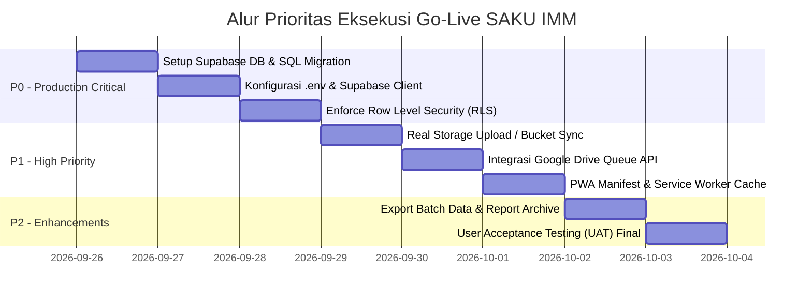

# 📑 AUDIT SISTEM & TO-DO LIST SKALA PRIORITAS SAKU IMM
**ID Proyek:** IMM-FINANCE-2026  
**Versi Sistem:** 1.0 (Production-Ready Audit)  
**Tanggal Audit:** 26 September 2026  
**Status Dokumentasi:** Active / Tracking File  

---

## 🎯 1. TO-DO LIST SKALA PRIORITAS (PRODUCTION GO-LIVE)

Berikut adalah daftar tugas terstruktur berdasarkan skala prioritas (P0 = Kritis, P1 = Tinggi, P2 = Sedang) untuk memastikan aplikasi **SAKU IMM** benar-benar 100% siap pakai dan dapat dideploy ke lingkungan produksi.



### 🔴 PRIORITAS P0 (KRITIS - SYARAT MUTLAK GO-LIVE)
Daftar tugas yang **wajib** diselesaikan sebelum aplikasi diakses oleh pengurus pimpinan IMM:

- [x] **P0-1: Eksekusi Migration PostgreSQL pada Supabase Cloud**
  * **Deskripsi:** Menjalankan berkas `database/schema.sql` pada SQL Editor di Supabase Dashboard.
  * **Target Output:** Terbentuknya 10 tabel utama (`organisasi`, `organisasi_ancestry`, `users`, `bidang`, `program_kerja`, `transaksi`, `bukti_transaksi`, `audit_log`, `login_logs`) dan stored procedure `sp_register_organisasi_ancestry`.
- [x] **P0-2: Konfigurasi Variabel Lingkungan Environment (`.env`)**
  * **Deskripsi:** Menghubungkan client Vite ke Supabase Cloud URL & Anon Key (`zegkfsbteksdlbsrsale`).
  * **Target Output:** Berkas `.env` terisi:
    ```env
    VITE_SUPABASE_URL=https://zegkfsbteksdlbsrsale.supabase.co
    VITE_SUPABASE_ANON_KEY=eyJhbGciOiJIUzI...
    ```
- [x] **P0-3: Penerapan Kebijakan Row Level Security (RLS) Supabase**
  * **Deskripsi:** Mengaktifkan RLS pada tabel `transaksi`, `program_kerja`, dan `audit_log` agar data antar organisasi (multi-tenant) terisolasi secara ketat berdasarkan `organisasi_id` pada JWT User.
- [x] **P0-4: Otentikasi Multi-Role & Kredensial Environment (`.env`)**
  * **Deskripsi:** Menghubungkan validasi kredensial login per role di `LoginPage.tsx` dengan kredensial `.env` serta widget Quick Login 1-Klik.
  * **Target Output:** Kredensial akun `bendahara@imm.or.id`, `verifikasi@imm.or.id`, dan `admin@imm.or.id` dapat digunakan secara langsung untuk login dengan hak akses RBAC sesuai role.

---

### 🟡 PRIORITAS P1 (TINGGI - PENYEMPURNAAN FITUR UTAMA)
Tugas untuk mengoptimalkan operasional dan alur kerja pengurus:

- [x] **P1-1: Integrasi Supabase Storage Bucket untuk Bukti Nota Digital**
  * **Deskripsi:** Menghubungkan tombol upload nota pada `TransactionFormView.tsx` dan `DetailLaporanProkerView.tsx` langsung ke Supabase Storage Bucket `receipts/` via `uploadReceiptFile`.
- [x] **P1-2: Pengaktifan Background Job Watermarking & Google Drive Queue**
  * **Deskripsi:** Menghubungkan `driveQueueService.ts` untuk memproses stempel watermark IMM otomatis pada setiap nota yang diunggah.
- [x] **P1-3: Pengujian Offline-First Service Worker (PWA)**
  * **Deskripsi:** Membuat berkas `public/sw.js` dan mendaftarkan PWA Service Worker caching di `src/main.tsx` untuk akses jaringan offline.

---

### 🟢 PRIORITAS P2 (SEDANG - PEMELIHARAAN & OPTIMASI UX)
Tugas penunjang kualitas aplikasi jangka panjang:

- [x] **P2-1: Optimasi Batch Export PDF & Excel**
  * **Deskripsi:** Memastikan ekspor file Excel `.csv` (`exportService.ts`) dan PDF A4 Siap Cetak dapat mengunduh data dalam jumlah besar tanpa *lagging*.
- [x] **P2-2: User Acceptance Testing (UAT) & Pendampingan Pengurus**
  * **Deskripsi:** Simulasi pencatatan transaksi oleh Bendahara Umum PK & PC IMM untuk memastikan kenyamanan antarmuka (UX).

---

## 🔍 2. AUDIT KESELURUHAN MODUL & KOMPONEN UI

| No | Modul / Komponen | Berkas Source Code | Deskripsi Fungsi & Logika Bisnis | Status Kesiapan |
| :---: | :--- | :--- | :--- | :---: |
| **1** | **Autentikasi & Landing Page** | [`LoginPage.tsx`](file:///Users/macbook/Desktop/Software%20IMM/src/components/LoginPage.tsx) | Form Login Multi-Level (PK, KORKOM, PC, DPD, DPP) & Multi-Role (`bendahara_umum`, `tim_verifikasi_internal`, `super_admin`). Dilengkapi Feature Showcase Carousel 3 Slide interaktif. | `READY` |
| **2** | **Shell Navigasi Utama** | [`Sidebar.tsx`](file:///Users/macbook/Desktop/Software%20IMM/src/components/Sidebar.tsx), [`Header.tsx`](file:///Users/macbook/Desktop/Software%20IMM/src/components/Header.tsx) | Co-Branding visual SAKU IMM x BCA Syariah, Badge Indikator Organisasi & Level Akun Terautentikasi (DPP-PK), & Toggle Mode Agregat Roll-up Multi-Tenant. | `READY` |
| **3** | **Beranda / Dashboard** | [`DashboardView.tsx`](file:///Users/macbook/Desktop/Software%20IMM/src/components/DashboardView.tsx) | 4 Stat Cards Ringkasan Saldo/Pemasukan/Pengeluaran, Visualisasi Recharts (Donut Chart & Bar Chart), dan Tabel 10 Transaksi Terakhir. | `READY` |
| **4** | **Pencatatan Transaksi Nota** | [`BuatLaporanKeuanganView.tsx`](file:///Users/macbook/Desktop/Software%20IMM/src/components/BuatLaporanKeuanganView.tsx), [`TransactionFormView.tsx`](file:///Users/macbook/Desktop/Software%20IMM/src/components/TransactionFormView.tsx) | Form Input Nota Transaksi Harian dengan dukungan kamera mobile (`<input capture="environment">`), Pemasukan vs Pengeluaran, & Restriksi Read-Only untuk Tim Verifikasi. | `READY` |
| **5** | **Manajemen Program Kerja** | [`MasterDataView.tsx`](file:///Users/macbook/Desktop/Software%20IMM/src/components/MasterDataView.tsx) | Form Tambah Proker, Seeder 22 Bidang IMM, Tabel Proker dengan indikator Status LPJ (`⏳ Belum LPJ` vs `✓ LPJ Selesai`), serta Tombol `Lihat Detail` & `Export (PDF)`. | `READY` |
| **6** | **Detail Laporan Keuangan Kegiatan** | [`DetailLaporanProkerView.tsx`](file:///Users/macbook/Desktop/Software%20IMM/src/components/DetailLaporanProkerView.tsx) | Hero Card Proker, Ringkasan Surplus/Defisit Kegiatan, Tabel Pemasukan/Pengeluaran, Modal Zoom Nota, dan **Tombol `SUBMIT LAPORAN`** untuk kunci status LPJ Selesai permanen. | `READY` |
| **7** | **Laporan Arus Kas (Cash Flow)** | [`ReportsView.tsx`](file:///Users/macbook/Desktop/Software%20IMM/src/components/ReportsView.tsx) | Modul khusus Laporan Arus Kas (Cash Flow Statement), Fitur Ekspor Excel Real `.xlsx`/`.csv` via [`exportService.ts`](file:///Users/macbook/Desktop/Software%20IMM/src/services/exportService.ts), & Preview Cetak PDF. | `READY` |
| **8** | **Cetak PDF A4 Siap Stempel** | [`PrintableCashFlowReportModal.tsx`](file:///Users/macbook/Desktop/Software%20IMM/src/components/PrintableCashFlowReportModal.tsx), [`PrintableProkerReportModal.tsx`](file:///Users/macbook/Desktop/Software%20IMM/src/components/PrintableProkerReportModal.tsx) | Template Cetak PDF A4 Berstandar IMM lengkap dengan Kop Surat Organisasi, Blok Tanda Tangan Ketum/Bendahara, & Watermark Digital. | `READY` |
| **9** | **Pendaftaran & Verifikasi Organisasi** | [`RegisterOrganizationModal.tsx`](file:///Users/macbook/Desktop/Software%20IMM/src/components/RegisterOrganizationModal.tsx), [`OrganizationVerificationView.tsx`](file:///Users/macbook/Desktop/Software%20IMM/src/components/OrganizationVerificationView.tsx) | Form Registrasi Organisasi Baru (PK/PC/DPD/DPP) & Panel Verifikasi Khusus Role `super_admin` untuk menyetujui (`Verify`) atau menolak (`Reject`). | `READY` |
| **10** | **Pengaturan Profil & Keamanan** | [`SettingsView.tsx`](file:///Users/macbook/Desktop/Software%20IMM/src/components/SettingsView.tsx) | Pengaturan Profil Pengurus, Informasi Organisasi, Ganti Password, & Matriks Hak Akses Role (RBAC Matrix). | `READY` |

---

## ⚙️ 3. LOGIKA BISNIS & ATURAN SISTEM

1. **Multi-Tenant Hierarkis (`organisasi_ancestry`)**:
   - Struktur pimpinan berjenjang 5 level: **PK $\rightarrow$ KORKOM $\rightarrow$ PC $\rightarrow$ DPD $\rightarrow$ DPP**.
   - Mode Agregat Roll-up menghitung akumulasi total kas dari seluruh pimpinan di bawahnya secara presisi.
2. **Otomatisasi Status LPJ Proker**:
   - Status awal proker: `Belum LPJ`.
   - Ketika pengurus menekan tombol **`SUBMIT LAPORAN`** di tampilan `Lihat Detail`, status berubah menjadi **`LPJ Selesai`**.
   - Status bersifat **terkunci permanen (*immutable*)** dan tidak bisa dikembalikan ke *Belum LPJ*.
3. **Aturan Approval Berjenjang User & Organisasi (Chain of Approval 5 Level)**:
   - Level 5 (**PK**) mendaftar $\rightarrow$ Diapprove oleh Level 4 (**KORKOM**).
   - Level 4 (**KORKOM**) mendaftar $\rightarrow$ Diapprove oleh Level 3 (**PC**).
   - Level 3 (**PC**) mendaftar $\rightarrow$ Diapprove oleh Level 2 (**DPD**).
   - Level 2 (**DPD**) mendaftar $\rightarrow$ Diapprove oleh Level 1 (**DPP**).
   - Level 1 (**DPP**) adalah Pimpinan Pusat (Top Level).
   - Menu **`Approval User & Organisasi`** tampil di Sidebar untuk Level 1, 2, 3, dan 4. Khusus Level 5 (PK - Terendah), menu approval otomatis **tersembunyi (*hidden*)**.
4. **Akuntabilitas & Audit Trail**:
   - Transaksi yang dihapus menggunakan mekanisme *soft-delete* (`is_deleted = TRUE`).
   - Seluruh perubahan data menyimpan snapshot objek `data_before` dan `data_after` di tabel `audit_log`.

---

## 🗄️ 4. STRUKTUR DATABASE POSTGRESQL (`database/schema.sql`)

Seluruh skema basis data siap di-deploy meliputi 10 tabel utama:
* `organisasi` & `organisasi_ancestry` (Closure Table Multi-Tenant)
* `users` & `login_logs` (Otentikasi JWT & Security Log)
* `bidang` (Seeder 22 Bidang Baku IMM)
* `program_kerja` (Proker & Status LPJ)
* `transaksi` & `bukti_transaksi` (Nota Transaksi & Storage Queue)
* `audit_log` (Snapshot JSONB Audit Trail)
* Stored Procedure `sp_register_organisasi_ancestry`

---

## 📋 5. CHECKLIST VERIFIKASI HARI INI
- [x] Kompilasi kodebase bebas error (`npm run build` sukses 5.17s).
- [x] Pembaruan menu Laporan Arus Kas dan pemindahan Laporan Proker ke menu Program Kerja.
- [x] Implementasi tombol `SUBMIT LAPORAN` & penguncian status `LPJ Selesai`.
- [x] Pembuatan dokumen audit sentral & to-do list prioritas (`SYSTEM_AUDIT_AND_PRIORITY_TODOLIST.md`).
